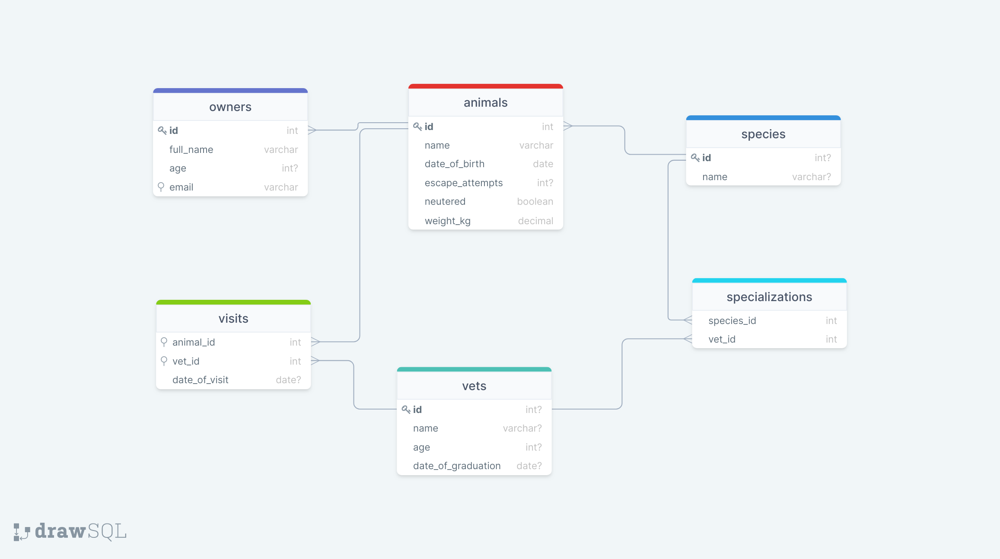
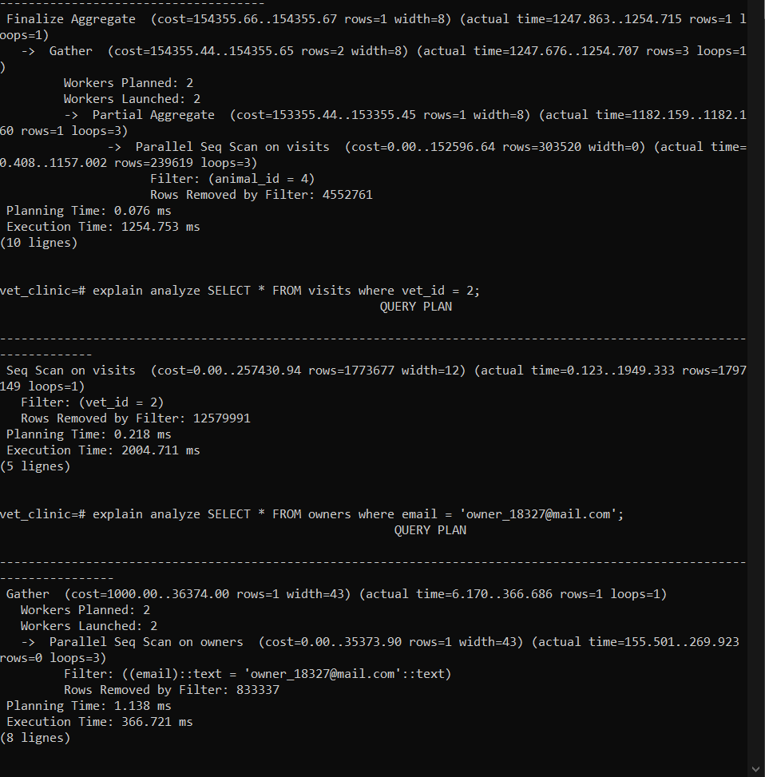
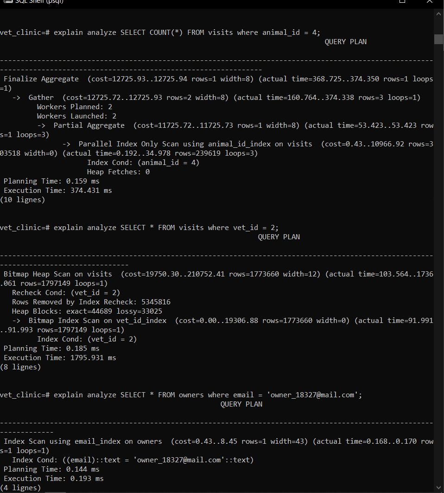

## Vet clinic database: database performance audit

In this project we optimize some slow queries in a postgres database and we achive that using the EXPLAIN ANALYZE to compare the execution times before and after optimization.

## Schema diagram 
  
## Sample screenshots
## Before
 

 ## After
  

## Getting Started

This repository includes files with plain SQL that can be used to recreate a database:

- Use [schema.sql](./schema.sql) to create all tables.
- Use [data.sql](./data.sql) to populate tables with sample data.
- Check [queries.sql](./queries.sql) for examples of queries that can be run on a newly created database. **Important note: this file might include queries that make changes in the database (e.g., remove records). Use them responsibly!**

## Authors

👤 **Youmari**

- GitHub: [@youmari](https://github.com/youmari)
- Twitter: [@yf_omari](https://twitter.com/yf_omari)
- LinkedIn: [LinkedIn](https://www.linkedin.com/in/yassine-omari-945114190/)

👤 **Gbenga**

- GitHub: [@Emmanuel Gbenga](https://github.com/gbengacode)

## 🤝 Contributing

Contributions, issues, and feature requests are welcome!

Feel free to check the [issues page](../../issues/).

## Show your support

Give a ⭐️ if you like this project!

## Acknowledgments

- Hat tip to anyone whose code was used
- Inspiration
- etc

## 📝 License

This project is [MIT](./MIT.md) licensed.
